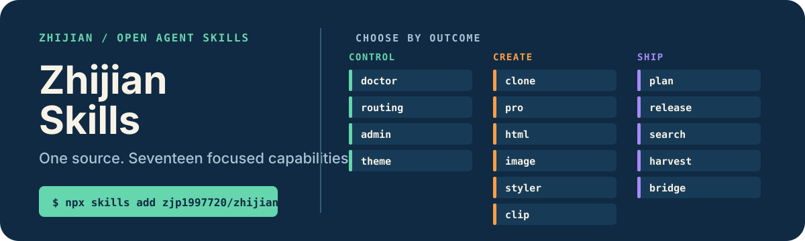

# 智见 Skills

<p align="center">
  
</p>

<p align="center"><strong>从一个可信源按需安装 Agent Skill；每个安装包都完整，每次发布都独立验证。</strong></p>

<p align="center">
  <a href="./README.md">English</a> ·
  <a href="#选择一个-skill">浏览目录</a> ·
  <a href="./CONTRIBUTING.md">参与贡献</a>
</p>

智见 Skills 是 19 个专注型 Agent Skill 的统一源码，覆盖 Codex 管理与体验、工作流编排、模型推理与基础设施、知识系统、内容调研、信息设计与发布流程。

## 30 秒开始使用

查看全部 19 个 Skill：

```bash
npx skills add zjp1997720/zhijian-skills --list
```

只安装当前需要的 Skill：

```bash
npx skills add zjp1997720/zhijian-skills --skill wechat-styler
```

全局安装到指定 Harness：

```bash
npx skills add zjp1997720/zhijian-skills \
  --skill codex-model-routing-team --agent codex --global --copy --yes
```

> 这是唯一发布仓库。新增 Skill、版本发布、Issue 和代码贡献全部进入这里。

## 在 WorkBuddy 中添加技能市场

打开 **专家·技能·连接器 → 技能 → 套件 → 添加市场**，在「市场源」填写：

```text
zjp1997720/zhijian-skills
```

完整地址 `https://github.com/zjp1997720/zhijian-skills.git` 也可以。添加后选择 `zhijian-skills`，按需安装单个套件；添加市场不会自动安装全部 Skill。

请使用仓库地址，不要填写 `/tree/main/skills` 目录网页或原始 JSON 地址。市场通过 Git 获取完整 Skill 文件，包括脚本、参考资料与素材。

市场展示不等于所有功能都支持 WorkBuddy：标有「需 Codex 宿主能力」的条目依赖 Codex；其他条目也可能需要本地 CLI、登录或依赖包，安装前请查看对应文档。市场适配不会更改这些运行条件。

市场清单从 `registry/skills.json` 和已有中文文档生成。维护者更新条目或版本后运行 `python3 scripts/build_workbuddy_marketplace.py`；CI 会检查清单是否同步。

`plugins/` 中的套件清单和仓库内符号链接均由脚本生成，源码仍只在 `skills/` 维护。安装器将链接物化成完整文件；Git 检出需要支持符号链接。已在 macOS WorkBuddy 验证，Windows 尚未实测。可用 `python3 scripts/verify_workbuddy_install.py --cli <WorkBuddy附带的codebuddy可执行文件>` 在临时配置目录验证安装、冷启动识别和文件哈希；加 `--source zjp1997720/zhijian-skills` 验证公开源。

## 选择一个 Skill

| 场景 | Skill | 直接得到什么 | 文档 |
| --- | --- | --- | --- |
| 模型基础设施 | [`codex-cli-model-bridge`](docs/skills/codex-cli-model-bridge/README.zh-CN.md) | 在 Codex 接入已验证的本机模型，同时保住 ChatGPT 历史 | [文档](docs/skills/codex-cli-model-bridge/README.zh-CN.md) |
| Codex 管理 | [`codex-doctor`](docs/skills/codex-doctor/README.zh-CN.md) | 只读诊断上下文、配置和工作区漂移 | [文档](docs/skills/codex-doctor/README.zh-CN.md) |
| 跨 Agent 交接 | [`codex-external-handoff`](docs/skills/codex-external-handoff/README.zh-CN.md) | 从 WorkBuddy 或 Claude Code 创建并监督持久 Codex 会话与结构化回传 | [文档](docs/skills/codex-external-handoff/README.zh-CN.md) |
| Codex 管理 | [`codex-handoff`](docs/skills/codex-handoff/README.zh-CN.md) | 把历史过大、响应变慢的 Codex task 换到一个紧凑的新 task 继续 | [文档](docs/skills/codex-handoff/README.zh-CN.md) |
| 图像生成 | [`codex-image-gen`](docs/skills/codex-image-gen/README.zh-CN.md) | 复用已登录 Codex CLI 的 OAuth 登录态，无 API Key 生成与编辑图片 | [文档](docs/skills/codex-image-gen/README.zh-CN.md) |
| Codex 管理 | [`codex-model-routing-team`](docs/skills/codex-model-routing-team/README.zh-CN.md) | 编译并行计划，默认 Sol Medium 执行，按风险分配模型 | [文档](docs/skills/codex-model-routing-team/README.zh-CN.md) |
| Codex 管理 | [`codex-skill-admin`](docs/skills/codex-skill-admin/README.zh-CN.md) | 审计、关闭、恢复并验证本地 Codex Skill | [文档](docs/skills/codex-skill-admin/README.zh-CN.md) |
| Codex 体验 | [`codex-theme-studio`](docs/skills/codex-theme-studio/README.zh-CN.md) | 用安全主题变量、自定义图片或内置预设构建可恢复的 macOS Codex 皮肤 | [文档](docs/skills/codex-theme-studio/README.zh-CN.md) |
| 知识系统 | [`enterprise-clone-builder`](docs/skills/enterprise-clone-builder/README.zh-CN.md) | 从企业证据构建结构化数字分身仓库 | [文档](docs/skills/enterprise-clone-builder/README.zh-CN.md) |
| 模型推理 | [`gpt56-sol-pro-consult`](docs/skills/gpt56-sol-pro-consult/README.zh-CN.md) | 通过 Codex Chrome 获得有文件依据、完成模型核验的 GPT 5.6 Sol Pro 二次判断 | [文档](docs/skills/gpt56-sol-pro-consult/README.zh-CN.md) |
| 信息设计 | [`html-express`](docs/skills/html-express/README.zh-CN.md) | 把高密度材料做成自包含 HTML 报告 | [文档](docs/skills/html-express/README.zh-CN.md) |
| 长篇写作 | [`leadbook`](docs/skills/leadbook/README.zh-CN.md) | 生产有证据、有状态和可审计质量门的中文商业书与白皮书 | [文档](docs/skills/leadbook/README.zh-CN.md) |
| 工作流编排 | [`light-plan-and-work`](docs/skills/light-plan-and-work/README.zh-CN.md) | 用短计划完成边界清楚的任务，只在重条件出现时升级 | [文档](docs/skills/light-plan-and-work/README.zh-CN.md) |
| 发布治理 | [`skill-open-sourcer`](docs/skills/skill-open-sourcer/README.zh-CN.md) | 审计、打包、文档化、验证并发布 Agent Skill | [文档](docs/skills/skill-open-sourcer/README.zh-CN.md) |
| 内容调研 | [`wechat-article-search`](docs/skills/wechat-article-search/README.zh-CN.md) | 把公众号关键词搜索结果输出为结构化 JSON | [文档](docs/skills/wechat-article-search/README.zh-CN.md) |
| 内容发布 | [`wechat-styler`](docs/skills/wechat-styler/README.zh-CN.md) | 把 Markdown 转成公众号兼容的精排内联 HTML | [文档](docs/skills/wechat-styler/README.zh-CN.md) |
| 内容归档 | [`web-clipper`](docs/skills/web-clipper/README.zh-CN.md) | 把公开文章 URL 和指定数量的归档页文章保存成结构化 Markdown | [文档](docs/skills/web-clipper/README.zh-CN.md) |
| 模型基础设施 | [`workbuddy-cli-model-bridge`](docs/skills/workbuddy-cli-model-bridge/README.zh-CN.md) | 通过仅本机代理把已验证的 CLI 订阅模型接入 WorkBuddy | [文档](docs/skills/workbuddy-cli-model-bridge/README.zh-CN.md) |
| 内容归档 | [`wxmp-article-harvester`](docs/skills/wxmp-article-harvester/README.zh-CN.md) | 把指定公众号导出成可信 Markdown、索引和完成度报告 | [文档](docs/skills/wxmp-article-harvester/README.zh-CN.md) |

## 为什么使用统一仓库

- **只有一个可编辑源。** 所有公开 Skill 都在本仓库 `main` 分支维护。
- **安装包保持完整。** 每个 Skill 依赖的脚本、参考资料、主题和资源都会一起安装。
- **版本独立，仓库统一。** 每个 Skill 保留独立版本、Changelog、统一仓库 Tag 和测试。

`codex-model-routing-team` 可以手动点名，也可以通过文档提供的 `AGENTS.md` 授权块，在并行执行具有明确净收益时自动触发。

## 仓库模型

```text
skills/<name>/          Agent 实际安装的完整载荷
docs/skills/<name>/     面向人的中英文文档
registry/skills.json    版本、验证、权限和 Harness 支持声明
assets/readme/          Portfolio 视觉资产
```

所有安装和发布都通过本仓库完成，不再创建或同步独立 Skill 仓库。

## 贡献与协议

提交 Issue 或 PR 前请阅读 [CONTRIBUTING.md](CONTRIBUTING.md)。Portfolio 使用 [MIT License](LICENSE)；各 Skill 的第三方声明继续随对应安装包发布。
