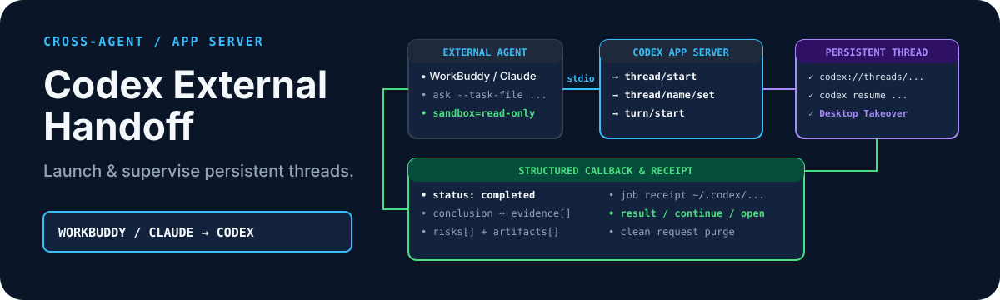

# Codex External Handoff

<p align="center">
  
</p>

<p align="center"><strong>从 WorkBuddy、Claude Code 或任何本地 Agent 无头调用 Codex App Server，创建可见、命名、持久的 Codex Thread——保留结构化结果回传、只读安全默认与随时人工接管能力。</strong></p>

<p align="center"><a href="./README.md">English</a> · <a href="https://github.com/zjp1997720/zhijian-skills/tree/main/skills/codex-external-handoff"> canonical 源码</a></p>

当外部本地 Agent（WorkBuddy、Claude Code、OpenCode 或自定义脚本）需要进行深度调研、跨项目检索、架构审校或确定性工程修改时，使用一次性无头命令既无法保留上下文，也无法在桌面端实时监督或继续追问。`codex-external-handoff` 建立了标准的本地交接通道：通过 stdio JSONL RPC 直连本地 `codex app-server`，创建带有明确标题且在 Codex Desktop App 与 CLI 中均持久可见的正式 Thread，在后台监督执行，并将经过模式校验的结构化结论、证据与产物回传给主调 Agent。

## 安装

```bash
npx skills add zjp1997720/zhijian-skills \
  --skill codex-external-handoff --agent codex --global --copy --yes
```

## 前置条件

- 本机已安装 Codex CLI 并完成登录（`codex auth login` 或 ChatGPT 登录）
- Python 3.9 及以上（仅依赖标准库，零第三方依赖包）
- macOS 或 Linux 本地系统，且 `codex` 命令位于 `PATH` 中
- 可选安装 Codex 桌面端应用（用于通过 `codex://threads/<threadId>` 一键打开并接管会话）

## 它能做什么

- **完整生命周期命令**：提供 `doctor`、`ask`、`continue`、`status`、`result`、`cancel` 与 `open` 六大核心动作
- **持久命名会话**：创建真实的非临时 Codex Thread，支持命名标题与持久 `thread_id`
- **后台可恢复监督**：Worker 独立后台运行，状态回执持久化于 `CODEX_EXTERNAL_HANDOFF_HOME` 或 `~/.codex/external-handoff`
- **结构化结果合同**：强约束 JSON 输出模式，规范返回 `status`、`conclusion`、`evidence[]`、`risks[]`、`artifacts[]`、`recommended_actions[]` 与 `suggested_state_delta`
- **默认只读安全防线**：默认强制 `sandbox=read-only` 与 `approvalPolicy=never`；只有明确指定 `--sandbox workspace-write` 时才允许工作区写入
- **随时接管与恢复**：同时输出 `codex://threads/<threadId>` URL Scheme 与 `codex resume <threadId>` 命令，方便人工随时接管

## 工作原理

1. **环境自检 (`doctor`)**：启动与 `codex app-server` 的轻量 stdio 通信，完成 `initialize` / `initialized` 协议握手，检查账户有效性与状态目录就绪情况。
2. **任务创建 (`ask`)**：落盘临时请求快照，拉起独立的后台监督 Worker，向 `codex app-server` 发送 `thread/start` 并设置会话标题 `thread/name/set`。
3. **Turn 执行**：向指定 Thread 发送 `turn/start`，注入任务内容、指定模型（默认 `gpt-5.6-sol`）、推理强度（`high` / `max`）与结构化输出 JSON Schema。
4. **流式监听与心跳**：实时捕获 `item/agentMessage/delta`、`item/completed` 与 `turn/completed` 事件，定期写入心跳时间戳至本地 Job 回执。
5. **结果提取与回传**：解析并校验结构化 JSON 输出，标记最终运行状态（`completed`、`blocked`、`failed`、`cancelled`、`timed_out`），为主调 Agent 提供权威回传。

## 示例请求

```text
把这个复杂的架构与安全性评审任务交给 Codex 持久 Thread，完成后把结构化结论回传给我。
```

```text
为跨项目素材检索开一个可见的 Codex 外援 Thread，保持只读模式并返回 threadId。
```

```text
基于刚才的 Codex 外援会话继续追问新的评测指标，保留已有对话上下文。
```

等价的直接调用：

```bash
# 检查本地 Codex 与 App Server 就绪状态
python3 scripts/codex_external_handoff.py doctor

# 创建后台外援任务
python3 scripts/codex_external_handoff.py ask \
  --title "系统架构与安全性审校" \
  --task-file ./task-package.md \
  --cwd "$PWD" \
  --model gpt-5.6-sol \
  --effort high

# 查询状态、读取结果或在桌面 App 中打开
python3 scripts/codex_external_handoff.py status ceh-20260821-100000-abcd1234
python3 scripts/codex_external_handoff.py result ceh-20260821-100000-abcd1234
python3 scripts/codex_external_handoff.py open ceh-20260821-100000-abcd1234
```

## 安全与边界

- **强制沙箱默认**：默认采用 `read-only` 且 `approvalPolicy=never`，外部 Agent 不会因调用外援而意外修改工作区文件。
- **禁止危险模式**：交接通道明确禁止 `danger-full-access` 全权限模式。
- **任务正文安全暂存**：任务正文仅在启动前暂存，Worker 读取后立即删除；运行回执保存在本机用户目录，绝不污染项目 Git 树。
- **单线程串行约束**：每个 Thread 同一时刻只执行一个 turn；需要并发分析时应创建多个独立的 handoff Thread。
- **依赖本地 App Server**：依赖本机已安装并登录的 `codex` CLI，不提供无本地守护进程的纯云端穿透。

## 仓库结构

```text
skills/codex-external-handoff/
├── SKILL.md
├── agents/
│   ├── interface.yaml
│   └── openai.yaml
├── evals/
│   ├── semantic_config.json
│   └── trigger_cases.json
├── manifest.json
├── references/
│   ├── app-server-contract.md
│   └── task-package.md
├── requirements.txt
├── scripts/
│   └── codex_external_handoff.py
├── security/
│   └── permission_policy.json
└── tests/
    └── test_codex_external_handoff.py
```

## 许可证

[MIT](../../../LICENSE)
