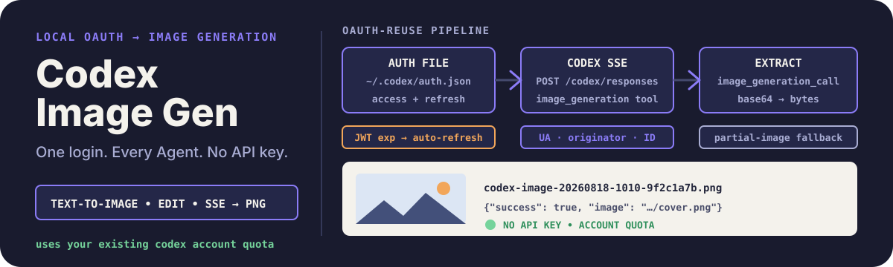

# Codex Image Gen

<p align="center">
  
</p>

<p align="center"><strong>把已经登录的 Codex CLI 变成任何 Agent 都能用的生图能力——不需要 API Key，一个零依赖的 Python 脚本。</strong></p>

<p align="center"><a href="./README.md">English</a> · <a href="https://github.com/zjp1997720/zhijian-skills/tree/main/skills/codex-image-gen"> canonical 源码</a></p>

多数本地 Agent 想生图，都得先买一个 OpenAI API Key 再接线。如果你已经在用 `codex` 并且用 ChatGPT 账号登录过，这个 Skill 直接复用那份 OAuth 登录态来驱动 `gpt-image-2`：自动刷新过期 token、带上后端必需的请求头调用 Codex Responses 接口、解析 SSE 流、把图片写成本地 PNG。Claude Code、Codex、OpenCode 或任何能跑 `python3` 的 Agent 都能用。

## 安装

```bash
npx skills add zjp1997720/zhijian-skills \
  --skill codex-image-gen --agent codex --global --copy --yes
```

## 前置条件

- 已安装 Codex CLI，并且执行过一次 `codex auth login`
- 运行 Agent 的机器上存在可读的 `~/.codex/auth.json`
- Python 3.9 及以上；无任何第三方依赖
- 机器可访问 `chatgpt.com` 与 `auth.openai.com`

## 它能做什么

- 文生图，支持 `--prompt` 或 `--prompt-file`
- 图像编辑与 image-to-image：`--image` 与可重复传入的 `--reference-image`（本地路径、HTTP(S) URL 或 data URL）
- 三档可控比例——`square`（1024x1024）、`landscape`（1536x1024）、`portrait`（1024x1536）——以及 `--quality low|medium|high`
- 解析 access token 的 JWT 过期时间，过期时用 refresh token 刷新，并把新 token 写回 `~/.codex/auth.json`
- 从 SSE 流提取最终图片，必要时回退到最后一帧 partial 图，保存为 PNG
- 输出一行可解析的 JSON——`{"success": true, "image": "/absolute/path.png"}`

## 工作原理

1. 脚本读取 `~/.codex/auth.json`，解码 access token 的 JWT payload，临过期时通过 `auth.openai.com` 刷新。
2. 按后端要求的请求头（`User-Agent: codex_cli_rs/0.0.0`、`originator: codex_cli_rs`、`ChatGPT-Account-ID`）调用 Codex Responses 接口，这正是避免莫名 403 的关键。
3. 外层模型挂载绑定 `gpt-image-2` 的 `image_generation` 工具；本地输入图会 base64 编码成 `input_image` 内容。
4. SSE 解析器保留最后一个 `image_generation_call.result`，缺失时回退到最后一个 `partial_image_b64`，解码后写成 `codex-image-<时间戳>-<prompt哈希>.png`。

## 示例请求

```text
用蓝白配色生成一张极简课程封面插图，16:9，无文字，保存到 ./outputs
```

```text
这台机器没有 OpenAI API Key，但 Codex CLI 已经登录了。画一张极简科技插图。
```

```text
把 draft.png 改成干净的白板商业插图风格，参考 style-ref.png 的风格。
```

等价的直接调用：

```bash
python3 scripts/codex_image.py \
  --prompt "蓝白配色的 AI 课程封面插图，几何感，极简，无文字" \
  --aspect landscape --quality high --out-dir ./outputs
```

## 安全与边界

- 本 Skill 复用你自己的 ChatGPT/Codex 登录态，消耗该账号的生图额度；不会凭空产生额度。
- refresh token 是一次性的，所以脚本刷新成功后立即以 `0600` 权限写回 `~/.codex/auth.json`。
- `401` 表示本地登录态失效——重新执行 `codex auth login`。`403` 通常是请求头缺失或 Cloudflare/账号风控，不要误判成 prompt 问题。
- 生图行为受你的账号条款约束；prompt 与参考图都应在账号允许处理的范围内。
- 每次运行生成一张图。批量调度、任务队列和高级后处理明确不在范围内。
- 上游响应结构变化时，脚本会显式失败而不是保存坏数据；`references/api-notes.md` 记录了完整协议细节便于修复。

## 仓库结构

```text
skills/codex-image-gen/
├── SKILL.md
├── agents/openai.yaml
├── evals/evals.json
├── references/api-notes.md
├── scripts/codex_image.py
└── tests/test_codex_image.py
```

## 许可证

[MIT](../../../LICENSE)
