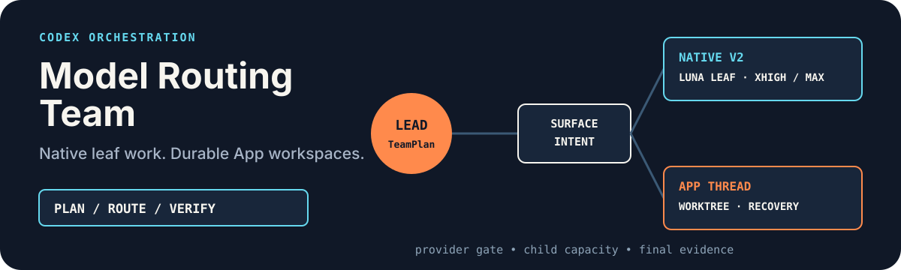

# Codex Model Routing Team

<p align="center">
  
</p>

<p align="center"><strong>Default complex work to Luna XHigh/Max App threads while one lead owns integration and verification.</strong></p>

<p align="center"><a href="./README.zh-CN.md">简体中文</a> · <a href="https://github.com/zjp1997720/zhijian-skills/tree/main/skills/codex-model-routing-team">Canonical source</a></p>

Use it when parallel execution has a clear net benefit: the lead compiles a lightweight TeamPlan, bounded Workers own independent deliverables, and explicit RoutePlans choose their models, reasoning levels, and speeds.

## Install

The standard `skills` CLI shorthand is valid:

```bash
npx skills add zjp1997720/zhijian-skills
```

For a global Codex installation without symlinks:

```bash
npx skills add zjp1997720/zhijian-skills \
  -g -a codex --skill codex-model-routing-team --copy -y
```

The full canonical GitHub URL works too:

```bash
npx skills add https://github.com/zjp1997720/zhijian-skills \
  -g -a codex --skill codex-model-routing-team --copy -y
```

Verify that the installed package contains both the entrypoint and its supporting policies:

```bash
npx skills ls -g -a codex
find ~/.agents/skills/codex-model-routing-team -maxdepth 2 -type f | sort
```

The file list must include `SKILL.md`, `references/team-plan.md`, `references/model-registry.json`, `references/audit-schema.json`, `references/native-audit-schema.json`, `references/surface-selection-policy.md`, `references/native-subagent-lifecycle.md`, `references/routing-policy.md`, `references/provider-policy.md`, `references/recovery-policy.md`, `references/task-packet.md`, `references/thread-lifecycle.md`, `references/thread-supervision-protocol.md`, `scripts/route_policy.py`, `scripts/model_preflight.py`, `scripts/validate_team_plan.py`, `scripts/validate_route_plan.py`, and `scripts/validate_team_ledger.py`. If only `SKILL.md` appears, remove that incomplete installation and install the current release again.

## Activate it

Explicit activation works immediately after installation:

```text
Use $codex-model-routing-team to research these six independent topics in parallel, then verify and synthesize the findings.
```

To let Codex activate the Skill automatically for suitable complex work, add the following standing authorization to `~/.codex/AGENTS.md`. Put it in a project-level `AGENTS.md` instead when the authorization should apply only to that project.

```markdown
## Codex background model-routing authorization

- The user authorizes Codex to use `$codex-model-routing-team` automatically when work can be safely split into at least two independently verifiable deliverables and the expected time or model-cost savings exceed creation, supervision, and integration cost without lowering the quality floor. Before dispatch, briefly state the Worker count, surface, exact model, reasoning level, speed, and responsibility. No additional confirmation is required.
- Before creating two or more Workers, the lead must compile a lightweight TeamPlan. Existing CE Plans, Codex Plans, and upstream Skill plans are compiled rather than rewritten. TeamPlan does not create a separate Planner, enter a heavyweight planning flow, or persist files by default.
- The lead agent keeps its current model and owns planning, file ownership, integration, verification, and final delivery.
- Use App threads by default. Native subagents are explicit-request or predeclared-fallback only because the current official V2 live schema does not expose Luna.
- Run at most 6 Workers concurrently and make at most 8 Worker attempts for one root task; failures, non-materialized calls, and fallbacks count. Workers must not create more Workers or subagents.
- Workers must not use Ultra. Terra is opt-in and excluded from automatic routing. Luna is App-only and starts at XHigh; Sol starts at High on every surface. Only App Luna may request Fast, with live `service_tier=priority` evidence; Sol and Terra remain Standard. Unavailable combinations follow only a predeclared fallback or return to the lead agent.
- Do not auto-dispatch simple questions, status checks, small single-file edits, strongly sequential work, publishing, sending, payment, deletion, account, or production operations.
```

This is user-configured Codex instruction, not a hidden OpenAI system prompt. Explicit `$codex-model-routing-team` requests remain available without the standing authorization.

## Why this exists

Current official Codex native V2 spawn schemas can expose per-worker model and reasoning controls, but the live schema does not expose Luna. Support remains runtime- and surface-specific, and a proxy catalog cannot be treated as evidence of official native support.

This Skill therefore defaults to App threads so Luna remains available. Ordinary work starts at Luna XHigh and difficult or high-risk work rises to Luna Max. Before dispatch, TeamPlan fixes units, dependencies, ownership, outputs, acceptance, and integration order; RoutePlan separately controls model routing. Native Sol remains available only for explicit requests or predeclared fallback.

Ordinary automatic groups use the governed App-thread path. `native-light` is retained only for explicit native requests or predeclared fallback; it validates RoutePlans and ledgers through stdin and avoids creating `agent_team/`. Both profiles keep the same safety gates.

## What it does

- Uses a net-benefit gate: at least two independently verifiable deliverables, with expected savings greater than coordination cost; otherwise the lead executes directly.
- Requires and validates a lightweight TeamPlan before dispatching two or more Workers, while compiling existing plans without rewriting them.
- Defaults to Luna XHigh App threads and raises difficult or high-risk work to Luna Max. Native Luna is rejected; Sol is High/XHigh/Max only and remains Standard. App Luna may use Fast only when the live create schema accepts `service_tier=priority`; Grok 4.5 stays conditional on runtime/provider preflight.
- Keeps `gpt-5.6-terra` opt-in and first-candidate-only. An unknown-model response fails that exact native route and never silently inherits the parent model.
- Retains explicit Gemini 3.6 Flash route templates while blocking the current third-party Antigravity login path; an official API/Vertex path needs a separate registry entry.
- Limits fan-out to three new Workers per wave, six concurrent Workers, and eight Worker attempts per root request across both surfaces.
- Uses the first business task for each model/reasoning/speed/tool signature as its final health probe, separating HTTP, thread materialization, model data, and delivery quality.
- Separates formal `threadId`, queued `pendingWorktreeId`, transport timeout, and ambiguous state; a unique task id recovers queued work, while `UNKNOWN` blocks follow-up, archival, fallback, and duplicate creation.
- Treats the latest official Thread/turn read as current truth and uses a minimal ledger validator for attempt, materialization, DATA_READY, and archive invariants.
- Uses `task_intent` and `mutation_authority` to keep inspection and verification Workers from expanding their write scope.
- Freezes fallback before dispatch, allows at most two Worker attempts per subtask, and permits one quality follow-up on the original Worker.
- Uses one Worker slot for a one-candidate plan and two only when a fallback candidate is declared.
- Acts as a dual-surface Orchestrator for upstream workflows such as Deep Research while preserving their stages, artifacts, and quality gates.
- Keeps publishing, payments, deletion, account changes, and production mutations in the lead task.

## How it works

1. The lead passes the net-benefit gate, compiles two or three TeamPlan units, and validates their graph and ownership before dispatch.
2. Each unit receives one Task Packet and one RoutePlan with a Provider allowlist, surface, and ordered candidate chain.
3. Registry and Provider policy are validated; native `model/reasoning_effort/speed` combinations also need live schema evidence, and Fast must accept `service_tier=priority`.
4. Automatic work uses governed Luna App threads. `native-light` is explicit-request or predeclared-fallback only, with Sol High or stronger.
5. Native V1 uses `fork_context=false`; V2 uses `fork_turns="none"`. App threads keep unique task ids and recover queued worktrees through official reads.
6. Requested, platform-accepted, and observed identities remain separate; failures advance only through the predeclared chain.
7. The lead verifies and integrates in TeamPlan order, closes adopted native Workers, and applies App completion and archival gates.

The lightweight path can validate in-memory JSON without leaving coordination files:

```bash
printf '%s' "$TEAM_PLAN_JSON" | python3 scripts/validate_team_plan.py -
printf '%s' "$ROUTE_PLAN_JSON" | python3 scripts/validate_route_plan.py -
printf '%s' "$TEAM_LEDGER_JSON" | python3 scripts/validate_team_ledger.py -
```

`max_worker_threads` equals the candidate-chain length. A single candidate with lead-agent takeover uses `1`; a declared fallback chain uses `2`.

When an upstream Skill already owns decomposition, this Skill compiles those units into TeamPlan while preserving stages, artifacts, and quality gates. It does not invent a second domain plan. Any task with a workspace output path is project-bound; only chat-only work may be projectless.

The default Deep Research budget is `2-4 researchers + 1 verifier + 1 reviewer + 2 retry slots`, within the cumulative eight-task cap.

## Example requests

```text
Use $codex-model-routing-team to implement, test, and review three independent modules without overlapping file ownership.
```

```text
Use $codex-model-routing-team to prepare a training deck with separate research, writing, and review tasks.
```

```text
Use $codex-model-routing-team as the routing Orchestrator for $deep-research. Preserve its verifier and reviewer stages.
```

## Requirements and boundaries

- Codex with a native subagent spawn surface that can confirm exact model/reasoning/speed combinations, Codex App thread tools, or both. If one declared surface is unavailable, only a predeclared fallback may use the other.
- Access to the models, reasoning levels, and speeds selected by the lead agent. If App `create_thread` has no speed parameter, that route remains Standard.
- Luna routes require XHigh or Max and use App threads. Sol routes require High, XHigh, or Max on every surface; Medium and Low are rejected even when explicitly requested.
- Provider terms, credential paths, and data boundaries must allow each cross-provider route. A working consumer subscription does not by itself authorize a third-party proxy.
- Worker creation must be verifiable. Native model acceptance and observed identity are recorded separately; App Thread materialization remains mandatory.
- Terra remains opt-in because live availability can differ from policy declaration. Ultra remains forbidden.

## Repository layout

```text
.
├── README.md
├── README.zh-CN.md
├── LICENSE
├── skills/
│   └── codex-model-routing-team/
│       ├── SKILL.md
│       ├── agents/
│       ├── evals/
│       ├── references/
│       └── scripts/
└── tests/
```

The agent workflow lives in [SKILL.md](../../../skills/codex-model-routing-team/SKILL.md). Supporting policies live in [references](../../../skills/codex-model-routing-team/references/).

## Validation

The workflow covers net-benefit selection; TeamPlan dependency layers, same-wave write conflicts, budget, revisions, and unplanned Worker detection; App-first Luna XHigh/Max routing; Native Luna and Sol Medium/Low rejection; speed audit; queued-worktree recovery; mixed ledgers; and isolated `npx skills` installation.

## License

[MIT](../../../skills/codex-model-routing-team/LICENSE)
