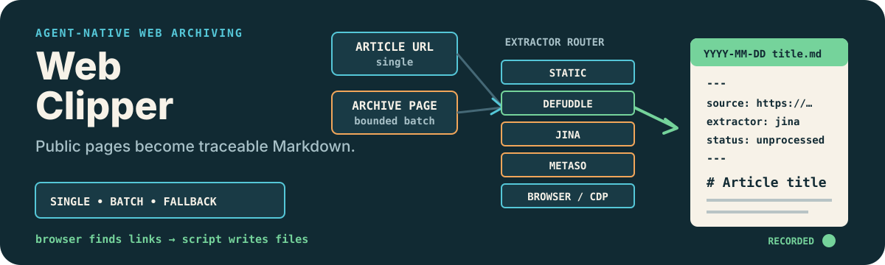

# Web Clipper

<p align="center">
  
</p>

<p align="center"><strong>Turn public article URLs and archive pages into portable, source-aware Markdown that an Agent can collect in batches.</strong></p>

<p align="center"><a href="./README.zh-CN.md">简体中文</a> · <a href="https://github.com/zjp1997720/zhijian-skills/tree/main/skills/web-clipper">Canonical source</a></p>

Use this Skill when an Agent needs to save one public article, collect a bounded set from an archive page, or fill gaps left by a manual browser clipper. It is designed for Obsidian and other local Markdown knowledge bases, but the output is plain Markdown and YAML.

## Install

```bash
npx skills add zjp1997720/zhijian-skills \
  --skill web-clipper --agent codex --global --copy --yes
```

## Requirements

- Python 3.9 or newer
- Network access to the public page
- Optional Node.js and `npx` for the pinned `defuddle@0.19.2` extractor
- Optional browser control for lazy archive pages or rendered-DOM fallback
- Optional `METASO_API_KEY` for Metaso Reader; enabling it may incur account charges and sends the target URL to a third party

Run all commands from the root of the vault or project that should receive the clipping. The supported entry point is:

```bash
bash <web-clipper-root>/scripts/run_web_clipper.sh --help
```

This first command is intentionally stateful: it checks Python, may attempt to install it, creates the default clipping directory, and writes `.web-clipper/EXTEND.md` inside the current project.

## What It Does

- Saves one public article as `YYYY-MM-DD title.md` with YAML frontmatter and body Markdown.
- Collects a bounded number of article links from an archive, index, topic, or author page.
- Lets a browser gather links from a lazy page, then gives the URL list back to the deterministic writer.
- Records which extractor succeeded: `static`, `defuddle`, `jina`, `metaso`, or `browser_cdp`.
- Produces `source_candidate` metadata for later review, knowledge compilation, or writing workflows.
- Reports link collection, body extraction, and file-writing failures separately instead of treating an empty batch as success.

## How It Works

1. The wrapper checks the runtime, resolves a project-local output directory, and writes reusable local configuration.
2. Public X articles and WeChat pages try pinned Defuddle first; ordinary pages try static HTML, JSON-LD, `<article>`, or `<main>` extraction first.
3. Failed pages fall through to Defuddle, Jina Reader, and optional Metaso in a site-aware order.
4. Lazy index pages use an available browser to collect URLs before the script writes each article.
5. If static extraction and the normal browser runtime both fail while the page is visible, an available CDP workflow can extract the rendered DOM and record `browser_cdp`.

The browser is used for the part it is good at—rendering and link discovery. The script owns repeatable file naming, metadata, body serialization, and batch receipts.

## Example Requests

```text
Save this public article to my Obsidian Clippings folder and preserve the source metadata: <URL>
```

```text
Collect the first 20 articles from this archive page as Markdown. If it lazy-loads, use the browser to gather URLs first: <URL>
```

```text
This WeChat article is visible in Chrome but static extraction failed. Save the complete rendered body and record the extractor used: <URL>
```

## Output

```yaml
---
type: "source_candidate"
title: "Example article"
source: "https://example.com/article"
published: "2026-08-04"
extractor: "static"
compile_status: "queued"
status: "unprocessed"
topics:
  - Agent
candidate_outputs:
  - source_card
  - writing_fuel
tags:
  - clipping
---
```

## Safety and Limitations

- Use only public HTTP(S) pages that you are authorized to access. The Skill does not bypass logins, paywalls, CAPTCHAs, or access controls.
- The wrapper accepts only output paths inside the current project. Run it from the intended vault root.
- Jina Reader and optional Metaso receive the target URL. Metaso is enabled by supplying `METASO_API_KEY`; confirm cost and data-transfer boundaries first.
- Defuddle runs as a pinned `npx` package. Without Node.js, the other extraction routes remain available.
- Browser and CDP fallback depend on the current Harness and an available browser-control Skill.
- Extracted articles can be copyrighted. Keep author, date, and source URL; use the result for authorized research or internal archiving, and do not republish full text without permission.
- Website layouts and anti-automation controls change. The Skill reports which layer failed, but it cannot guarantee successful extraction from every site.

## Repository Layout

```text
skills/web-clipper/
├── SKILL.md
├── agents/openai.yaml
├── evals/evals.json
├── references/config/first-time-setup.md
├── scripts/
└── tests/
```

## License

[MIT](../../../LICENSE)
