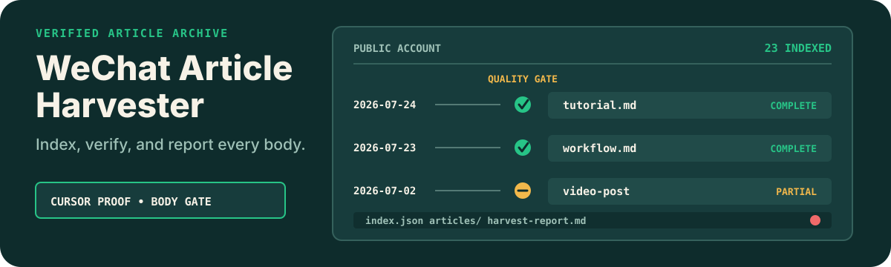

# WeChat Public Account Harvester

<p align="center">
  
</p>

<p align="center"><strong>Export a public WeChat account into portable Markdown, indexes, and a truthful completion report.</strong></p>

<p align="center"><a href="./README.zh-CN.md">简体中文</a> · <a href="https://github.com/zjp1997720/zhijian-skills/tree/main/skills/wxmp-article-harvester">Canonical source</a></p>

Use this Skill when an Agent needs to archive articles from a known WeChat public account over an exact date range, filter tutorial-like titles, fill article bodies, or continue a deep-history harvest safely.

## Install

```bash
npx skills add zjp1997720/zhijian-skills \
  -g -a codex --skill wxmp-article-harvester -y
```

## Requirements

- Python 3.10+
- [`wcx`](https://github.com/lovstudio/wcx), with the tested commit pinned in the Skill
- Python Playwright and Chromium
- A valid `mp.weixin.qq.com` backend login for account discovery and official article indexes
- Optional `METASO_API_KEY`, used only after explicit approval for paid third-party fallback

Run the deterministic preflight before the first harvest:

```bash
python3 scripts/preflight.py --json
```

The preflight reports missing dependencies. It does not install or upgrade software.

## What It Does

- Resolves a public account and exports its official article metadata through `wcx`.
- Filters by exact dates, year, recent period, or a transparent title regular expression.
- Extracts article bodies from the public page DOM with Playwright and preserves inline image order.
- Rejects summaries, generic video shells, verification pages, deleted pages, and low-information bodies.
- Writes Markdown articles plus JSON, CSV, Markdown indexes, and an unresolved-item report.
- Continues deep-history jobs with a configuration fingerprint, verified remote boundary, cursor date, cooldown, and explicit completion reason.

## Proof

In one dated Tencent WorkBuddy smoke test, the pipeline indexed 23 articles, selected 10 tutorial-like titles, saved 9 verified Markdown bodies, and reported one video-shell page as `partial`. This is a single-account test result, not a platform-wide success-rate claim.

## How It Works

1. `preflight.py` checks the runtime and the pinned `wcx` API contract.
2. `wcx_run.py` refreshes an expired backend session once, then exports account metadata.
3. `harvest_wxmp.py` applies date and title filters and evaluates any existing article body.
4. Playwright extracts the public DOM. The first WeChat verification page opens a circuit breaker, stopping later browser requests while preserving previously verified Markdown.
5. Atomic writers produce `articles/`, `index.json`, `index.csv`, `index.md`, `harvest-report.md`, and batch state when requested.

For resumable jobs, the Skill does not pretend that `wcx 0.2.0` exposes a CLI cursor. Its helper calls the tested Python API, tracks the remote total and head article, verifies the previous boundary article, and declares completion only after the cursor crosses the target date or the remote list is exhausted.

## Example Requests

```text
Export the last 30 days of articles from this WeChat public account as Markdown.
```

```text
把这个公众号从 2026-06-01 到 2026-06-30 的教程类文章抓下来，正文要完整，不要用付费 API。
```

```text
Continue the saved yearly harvest after its cooldown and report any cursor drift.
```

```text
Save this public mp.weixin.qq.com article as Markdown and preserve inline images.
```

## Output

```text
<account>/
├── articles/
│   └── YYYY-MM-DD title.md
├── index.json
├── index.csv
├── index.md
├── harvest-report.md
└── .harvest-state.json   # batch mode only
```

Every article record has a status. `browser`, `existing`, `wcx`, and explicitly authorized `metaso` results count as complete; `partial` means metadata exists but a trustworthy full body does not.

## Safety and Limitations

- The Skill accepts only public `https://mp.weixin.qq.com/s...` article URLs.
- Metadata requests are capped at 80 per batch. Resume commands enforce a cooldown unless the operator explicitly uses the test-only override.
- Login values and cookies are passed through protected runtime channels and are not printed or placed in command arguments.
- Metaso is disabled by default because it can cost money and sends the article URL to a third party.
- Video-only posts may remain `partial`; the Skill does not invent a text body.
- WeChat verification and anti-automation controls can temporarily reduce body extraction success. Existing verified files are preserved.
- Use harvested material only for authorized research, study, or internal archiving. Keep author, publication date, and source URL; do not republish copyrighted bodies without permission.

## Repository Layout

```text
skills/wxmp-article-harvester/
├── SKILL.md
├── agents/openai.yaml
├── evals/evals.json
├── references/troubleshooting.md
├── scripts/
└── tests/
```

## License

[MIT](../../../LICENSE)
