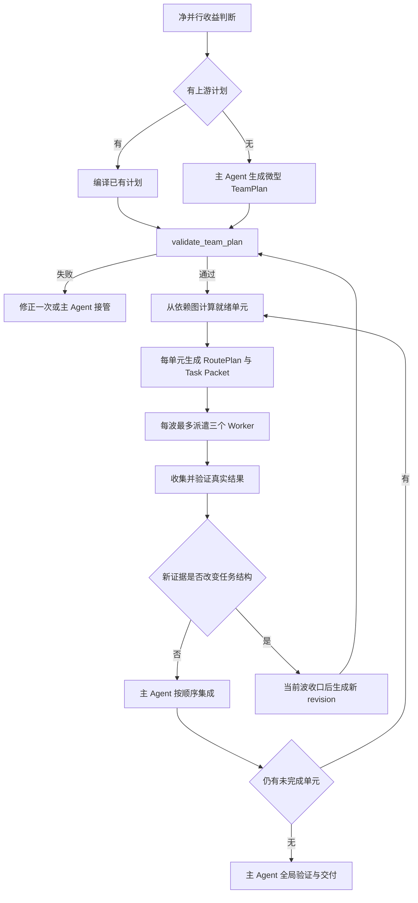

# Codex Model Routing Team：轻量 TeamPlan 编译层

## 决策摘要

在现有 `codex-model-routing-team` 内增加轻量 TeamPlan 编译层，不新建独立 Planner Skill。主 Agent 准备创建两个及以上 Worker 时，必须先把根任务或已有上游计划编译为可验证的 Worker 执行图，再为每个单元生成现有 RoutePlan 和 Task Packet。

TeamPlan 负责「谁做什么、何时执行、如何交付与集成」；RoutePlan 继续负责 `surface / model / thinking / speed`。已有 CE Plan、Codex Plan 模式结果或领域 Skill 计划时只编译、不重写业务目标、阶段、路径和质量门。

自动触发不再依赖任务是否笼统地“复杂”。只要任务存在明确净并行收益，且可以在不降低质量下限的前提下更快或更省，就应自动使用本 Skill。TeamPlan 必须保持轻量：默认由主 Agent 一次编译 2–3 个 Worker 单元，不创建 Planner Worker、不调用重型计划流程、不写持久计划文件。

## 问题

当前 Skill 已经定义模型路由、Provider 与数据边界、Task Packet、Thread 生命周期、失败回退、并发限制、单写者和主 Agent 验收，但从“值得并行”直接跳到“为每个子任务生成 RoutePlan”。它声明主 Agent 负责规划和分工，却没有规定子任务如何从根任务产生。

Task Packet 解决的是已经决定派遣之后如何给 Worker 完整上下文；RoutePlan 解决的是该 Worker 在哪个 Surface、使用什么模型和推理强度；两者都不负责：

- 把总目标拆成几个有边界的执行单元；
- 判断哪些单元可以并行、哪些必须串行；
- 分配文件或语义所有权；
- 约定 Worker 之间的交付接口；
- 安排集成顺序、验证职责和重试额度；
- 在并行收益低于协调成本时主动拒绝派遣。

有上游业务 Skill 时，上游计划天然补足这层；普通复杂任务直接触发模型路由时，主 Agent 只能临时编写分工，质量、粒度和上下文成本都不稳定。

## 目标

- 对所有两个及以上 Worker 的自动或显式调度建立统一、轻量、可验证的分工契约。
- 将领域规划、团队编排和模型路由分成三个稳定层级。
- 让主 Agent 主动评估净并行收益，做到应派尽派，同时避免为了 MultiAgent 而 MultiAgent。
- 保留主 Agent 对目标、关键判断、文件所有权、集成、最终验证和交付的责任。
- 复用现有 RoutePlan 2.1、Task Packet、双 Surface 生命周期、ledger 和恢复协议。
- 对 2–3 Worker 的普通任务保持低上下文和低延迟，不引入第二套业务账本。

## 非目标

- 不新建独立 Team Planner Skill。
- 不替代 CE Plan、Codex Plan 模式、Deep Research 或其他领域规划流程。
- 不让 Worker 自己拆分任务或继续创建 Agent、Thread 和后台任务。
- 不改变 Luna、Sol、Terra、Grok、Gemini、Fast、Provider 或 fallback 策略。
- 不让 TeamPlan 记录 Thread 运行状态或替代现有 ledger。
- 不为单 Worker、简单问答、状态查询、单文件小改或强顺序任务强制创建 TeamPlan。
- 不自动修改 Compound Engineering 插件缓存、Codex Plan 模式或 `light-plan-and-work`。

## 三层计划架构

| 层级 | 回答的问题 | 权威来源 |
| --- | --- | --- |
| Domain / Implementation Plan | 做什么、采用什么业务或技术方案 | CE Plan、Codex Plan、上游 Skill 或已确认的用户目标 |
| TeamPlan | 哪些 Worker 做什么、依赖和所有权是什么、怎样集成与验收 | `codex-model-routing-team` |
| RoutePlan | 每个单元在哪个 Surface、使用什么模型、推理强度和速度 | 现有 RoutePlan 2.1 与模型注册表 |

TeamPlan 不得填补尚未确认的产品需求或领域方案。如果目标、边界或验收仍不明确，应回到相应的 discovery、brainstorming、CE Plan 或领域 Skill；不能为了凑出 Worker 图而猜测。

## 自动触发收益门

主 Agent 用一次有界判断回答三个问题：

1. 能否拆出至少两个边界清楚、各自拥有独立交付物的 Worker 单元？
2. 能否为每个单元定义完成标准，同时由主 Agent 保留集成和最终验证？
3. 预计并行节省的关键路径时间或模型成本，是否高于 Thread 创建、上下文准备、监督和结果集成成本？

三个条件同时满足时自动启用本 Skill，无需额外询问用户，也不再判断任务是否“足够复杂”。不满足时输出一句简短的 `lead_only` 原因并由主 Agent直接完成；负向路径不构造完整 TeamPlan。

质量下限通过硬门而不是主观承诺保证：

- 没有明确完成标准的单元不得派遣；
- 关键业务判断和最终责任不得下放；
- Worker 输出本身不能作为完成证据；
- 主 Agent 必须检查真实文件、来源或运行结果并完成全局验证；
- 模型仍遵守 Luna XHigh 起步、高难或高风险升 Max、Sol High 起步等现有规则。

现有自动禁用边界继续保留：简单问答、状态查询、单文件小改、强顺序任务以及发布、发送、付款、删除、账户和生产操作不自动派遣。Worker 只能为不可逆外部动作准备材料。

## TeamPlan 契约

TeamPlan 使用 `schema_version: "1.0"`。`units` 只记录 Worker 单元；主 Agent 的责任由顶层集成与最终验证字段明确保留。默认最小形状为：

```yaml
schema_version: "1.0"
revision: 1
supersedes_revision: null
planning_source: ad_hoc | codex_plan | ce_plan | upstream_skill
source_refs: []
root_goal: "最终要完成的结果"
units:
  - unit_id: U1
    role: researcher | implementer | verifier | reviewer | custom
    goal: "该 Worker 要完成什么"
    output: "可检查的交付物或路径"
    depends_on: []
    ownership:
      write: []
      forbidden: []
    done_when: "可观察的完成条件"
  - unit_id: U2
    role: verifier
    goal: "独立验证另一个有边界的子目标"
    output: "验证结论或声明路径"
    depends_on: []
    ownership:
      write: []
      forbidden: []
    done_when: "验证证据完整且可由主 Agent 复核"
reserved_slots: 2
integration_order: [U1, U2]
final_verification: "主 Agent 的全局验收"
revision_reason: initial
```

每个 Worker 只有七个核心字段：`unit_id / role / goal / output / depends_on / ownership / done_when`。`supersedes_revision` 在初始版本为 `null`，后续 revision 必须指向直接上一版本。数据等级、Provider、工具、模型、推理强度和速度继续进入 Task Packet 与 RoutePlan，不复制进 TeamPlan。

`source_refs` 在上游模式下记录计划路径、稳定单元 ID 或 Codex Plan 的会话内来源标识。TeamPlan 引用上游事实，不复制完整需求正文。`ownership.write` 为空表示只读或只返回聊天结果；写入任务必须使用仓库相对路径或上游定义的可移植输出标识。

## 轻量与耐久模式

### 微型 TeamPlan（默认）

- 一般包含 2–3 个 Worker 单元；
- 由主 Agent 一次有界扫描生成；
- 不创建 Planner Worker；
- 不为拆分任务做全仓研究；
- 不自动调用 CE Plan；
- 不写持久 TeamPlan 文件；
- 通过 stdin 交给 validator；
- 派遣前只向用户展示 Worker 数、精确路由和职责简报，不倾倒完整 JSON。

### 耐久 TeamPlan

出现任一信号时复用现有 durable mode：四个以上 Worker、多阶段、预计长时间运行、需要中断恢复、上游已有耐久账本或用户明确要求持久记录。TeamPlan 作为现有 run envelope 的计划部分保存，不能创建第二套状态事实源。

如果一次有界编译后仍无法写清交付物、依赖或验收，停止继续猜测。主 Agent直接执行，或在原任务本身确实需要重型规划时进入 CE Plan／领域工作流。

## 上游计划适配

### CE Plan

- 保留稳定 U-ID，并写入 `source_refs`；
- `Dependencies` 映射为 `depends_on`；
- `Files` 用于建立 `ownership`，但主 Agent 仍需判断读写性质；
- `Goal`、`Verification` 和相关 Test Scenarios 编译为 `goal` 与 `done_when`；
- 不调用 `ce-work`，避免它与本 Skill 同时成为 Orchestrator；
- 不重新研究或重写 Product Contract、KTD、Definition of Done 和业务范围。

### Codex Plan 模式

Plan 模式中的步骤只作为输入。退出只读 Plan 模式后，主 Agent 才将其编译成 TeamPlan，并补足交付物、依赖、所有权和验收。原计划不能直接当作 Worker Task Packet。

### 领域 Skill

上游 Skill 继续拥有任务目标、Scale、业务单元、阶段顺序、产出路径和质量门。TeamPlan 只增加 Worker 分配、依赖检查、所有权、预算和集成顺序；遇到冲突时，上游业务流程优先，现有路由安全上限仍保持强制。

## 调度与数据流



依赖图是调度的唯一事实源。Validator 从 DAG 计算就绪层，再按“每波新增最多 3 个”切分；TeamPlan 不重复手写 wave，避免依赖与波次矛盾。跨 Surface 同时运行最多 6 个、根任务累计最多 8 次 Worker attempt 的现有限制保持不变。

每个 Worker 单元必须形成唯一链路：

```text
TeamPlan Unit
  ├─ Task Packet
  ├─ RoutePlan
  └─ Worker Ledger Record
```

App 与 native 两套 Worker 审计记录增加 `unit_id` 和 `team_plan_revision`。Run envelope 使用 `{team_plans, active_team_plan_revision, workers}`：普通任务的 `team_plans` 只有 revision 1；发生结构性重规划时按顺序保留旧 revision，并由 `active_team_plan_revision` 指向当前版本。微型模式在主 Agent 上下文中保留该 envelope，并通过 stdin 交给最终 ledger validator；耐久模式把同一对象写入已有账本。TeamPlan 是计划事实，不记录 Thread 控制状态。

## 所有权与并行安全

Validator 拒绝同一就绪层中明显重叠的写入范围，包括相同路径和父子路径。未声明写入边界、使用过宽目录、通配规则无法安全解析或语义所有权不明确时，主 Agent 必须串行化或重新拆分，而不能把 validator 的沉默当作并行安全证明。

文件不重叠也不等于语义独立。共享 API、schema、migration、lockfile、生成物、注册表、单例服务、数据库、浏览器会话或速率限制仍由主 Agent 在收益门和 Task Packet 中判断。并行速度是可选收益，正确性优先。

## 失败与重规划

三类失败必须分开处理：

1. **路由失败**：精确 Surface／模型／强度／速度不可用时，只沿该单元预声明的 RoutePlan fallback 前进，不修改 TeamPlan。
2. **Worker 执行失败**：输出不完整或单元验证失败时，仍属于同一 unit；先进行一次 follow-up，必要时使用第二次 Worker attempt，不重新拆计划。
3. **任务结构失效**：只有新证据改变依赖、所有权、交付物、范围或验收时，才允许生成 TeamPlan 新 revision。

重规划只能在当前派遣波全部收口后发生。新 revision 必须记录失效证据、尚未派出单元的差异和剩余预算；已完成或正在运行的单元不得被静默改写。上一 revision 仍有活动 Worker 时，validator／ledger gate 拒绝派遣新 revision。

Unit ID 在一个根任务内保持稳定：语义未变的单元沿用原 ID；拆分时原概念保留原 ID，新概念使用下一个未使用 ID；被删除的 ID 留空且不得复用；目标发生实质替换时使用新 ID。Worker ledger 通过 `team_plan_revision + unit_id` 解析该次派遣的确切语义。

如果一次 revision 仍无法形成明确单元，停止重规划并由主 Agent接管或进入任务原本需要的重型计划流程。

## Validator 设计

新增无第三方依赖的 `scripts/validate_team_plan.py`，与现有 validator 一样接受单个 revision 的 JSON 文件路径或 `-` stdin，并输出机器可读 JSON。它检查：

- schema version、根目标、revision 和来源字段；
- 至少两个且不超过并发上限的 Worker 单元；
- unit ID 唯一，依赖存在、无自依赖和无环；
- 每个单元具有 role、goal、output、ownership 和 done_when；
- 同一就绪层不存在明显写入路径重叠；
- `planned workers + reserved_slots <= 8`；
- integration order 只引用真实单元、覆盖全部单元并尊重依赖顺序；
- final verification 非空且明确由主 Agent负责；
- 上游模式存在 source refs；
- revision 与 revision reason 合法；revision 大于 1 时声明被替代的上一版本。

Validator 输出计算后的 dispatch waves，但不把 waves 写回 TeamPlan。它不判断技术方案正确性、隐含语义冲突、模型选择或 Worker 是否真实完成。

现有 `validate_team_ledger.py` 在 root envelope 含 `team_plans` 时另外检查：

- revisions 单调递增且 `active_team_plan_revision` 指向已存在版本；
- 每个 Worker 记录引用该 revision 中真实的 `unit_id`；
- 没有计划外 Worker；
- fallback 仍关联原 unit；
- 新 revision 派遣前旧 revision 没有活动 Worker；
- 被采纳结果仍满足现有 materialization、identity、output、close／archive 门。

未派遣的计划单元作为 run summary 警告和主 Agent 交付检查项，不一律判为 ledger 错误：它可能因 revision 替换、静态路由门或主 Agent 接管而没有 Worker attempt。最终交付必须说明其处置，不能静默遗漏。

## 全局 AGENTS.md 同步

用户级系统提示词只保留跨项目的授权和硬门，不复制 TeamPlan schema。自动触发语义调整为：当任务可以安全拆成两个以上拥有独立交付物的 Worker 单元，且预计在不降低质量下限的前提下，时间或模型成本净收益高于创建、协调和集成成本时，自动使用 `$codex-model-routing-team`。

另增加一条：准备创建两个以上 Worker 时，主 Agent 必须先生成轻量 TeamPlan；已有 CE Plan、Codex Plan 或上游 Skill 计划时只编译、不重写。TeamPlan 默认不创建独立 Planner、不进入重型规划流程、不写持久文件。

模型、并发、Fast、Provider、禁用动作和派遣前简报规则保持不变。全局文件是用户环境配置，不进入 Portfolio commit；在 Skill 实现完成后单独同步并进行新任务验证。

## 文件范围

计划新增：

- `skills/codex-model-routing-team/references/team-plan.md`
- `skills/codex-model-routing-team/scripts/validate_team_plan.py`
- `skills/codex-model-routing-team/evals/team-planning.json`

计划修改：

- `skills/codex-model-routing-team/SKILL.md`
- `skills/codex-model-routing-team/references/task-packet.md`
- `skills/codex-model-routing-team/references/upstream-skill-adapter.md`
- `skills/codex-model-routing-team/references/durable-mode.md`
- `skills/codex-model-routing-team/references/validation-cases.md`
- 两套 audit schema 与 `scripts/validate_team_ledger.py`
- `agents/openai.yaml` 与 `agents/interface.yaml`
- `tests/skills/test_codex_model_routing_team.py` 与 expected contract
- 中英文 README、changelog 和 Registry 版本／验证元数据
- 用户级 `~/.codex/AGENTS.md`（不进入仓库提交）

不修改模型注册表、路由矩阵、Fast、Provider、CE 插件缓存、Codex Plan 模式或 `light-plan-and-work`。

不新增独立 JSON Schema 引擎。字段契约由 `team-plan.md` 描述，机器判断统一由 dependency-free validator 完成，避免两套规则漂移。

## 测试与验证

### Validator 正常路径

- 两个独立 Worker 形成一个就绪层；
- 三个独立 Worker 保持单波；
- 四个独立 Worker 自动切为 `3 + 1`；
- 依赖单元进入后续就绪层；
- CE Plan U-ID 和上游 source refs 正确保留；
- 微型 TeamPlan 通过 stdin 验证且不创建状态目录。

### Validator 拒绝路径

- 缺少 output、ownership 或 done_when；
- unit ID 重复、依赖不存在、自依赖或成环；
- 同波写入相同文件或父子目录；
- Worker 与 reserved slots 超出 8 次预算；
- integration order 遗漏或引用未知单元；
- integration order 违反依赖顺序；
- final verification 缺失或下放给 Worker；
- 上游模式缺少 source refs；
- 新 revision 在旧波次仍活动时派遣；
- ledger 出现计划外 Worker、错误 revision 或 unit 映射；
- 未派遣单元未在最终 run summary 中说明处置。

### 行为评测

- 任务不大但净并行收益明确时自动派遣；
- 看似复杂但强顺序或集成成本高时由主 Agent完成；
- 三个独立来源自动拆成三个 Luna Worker；
- 两个 Worker 修改同一文件时串行化或重新分配所有权；
- 已有 CE Plan 时编译 U-ID，不重做计划；
- Codex Plan 模式结果在退出只读模式后再编译；
- 路由失败只使用 RoutePlan fallback；
- 新依赖只在当前波收口后触发 revision。

### 轻量性回归

- 2–3 Worker 不创建 Planner Thread、不调用 CE Plan、不写持久 TeamPlan 文件；
- `lead_only` 路径不构造完整 TeamPlan；
- Skill 初始正文继续满足现有 3000 字符门，详细规则按需加载；
- 现有 RoutePlan、模型、Fast、Provider、生命周期、恢复和 ledger 测试保持通过；
- 运行 Skill 定向测试、Portfolio contract／audit、隔离安装和完整回归。

## 验收标准

- 任意两个以上 Worker 的派遣都有通过验证的 TeamPlan；
- 每个 Worker 可追溯到唯一 TeamPlan unit、Task Packet、RoutePlan 和 ledger 记录；
- 主 Agent 保留集成和最终验证，计划无法把责任下放；
- 普通 2–3 Worker 任务不创建 Planner、重型计划或持久文件；
- 上游计划仍是业务 SSOT，TeamPlan 不复制或改写其业务含义；
- 同波明显写入冲突、依赖环、计划外 Worker、超预算和非法 revision 被机器拒绝；
- 不改变现有模型路由、Fast、Provider 与失败恢复语义；
- 全局自动授权从“复杂任务”收敛为“净并行收益为正”，同时保留现有禁用和安全边界。

## 风险与控制

- **计划开销反噬收益**：默认 2–3 单元、一次有界编译、stdin 校验，不创建 Planner 或持久文件。
- **机器校验制造虚假安全感**：Validator 只证明结构不变量；语义冲突、方案正确性和真实运行结果仍由主 Agent验证。
- **上游与 TeamPlan 双重 SSOT**：上游计划拥有业务事实，TeamPlan 仅引用并增加调度字段；运行状态只进入现有 ledger。
- **运行中频繁重规划**：只在结构性证据出现且当前波收口后生成 revision；路由或输出质量失败不触发重规划。
- **全局提示词膨胀**：全局只增加收益门和 TeamPlan 强制门，schema、适配和 validator 细节留在 Skill references。
- **初始 Skill 上下文回涨**：SKILL.md 只保留触发、轻量门和引用，继续受 3000 字符回归测试约束。
